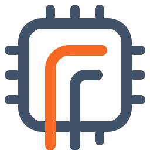

<p align="center">
  
</p>

# Flux

Flux is a design-space exploration (DSE) loop for hardware, driven by AI. You describe a
problem in a short YAML file: what to build, how to check it, what to measure, what to
optimise. A model or a coding agent proposes designs. Real tools check and measure them:
Verilator for correctness, Yosys and OpenROAD for area, timing and power on the ASAP7
teaching process, ChampSim for cache prefetchers. The loop keeps the designs that pass,
decides which one to build, and writes every measurement to a record you can read, resume
and report on. A design that fails its check is refused, never ranked. Some problems need
no model at all: a script generates the candidates and the loop only searches and measures.

## Install

Flux installs through Nix, which brings every tool: Verilator, Yosys, OpenROAD, ChampSim. The
loop alone, for problems that need no EDA tool, also installs with pip (see *Without Nix*
below).

1. Install Nix: <https://nixos.org/download>.
2. Enable flakes. Add this line to `~/.config/nix/nix.conf`:

   ```
   experimental-features = nix-command flakes
   ```

3. Clone the repository and enter the development shell:

   ```bash
   git clone https://github.com/choelzl/flux.git flux-repo
   cd flux-repo/flux
   nix develop --accept-flake-config
   ```

   `--accept-flake-config` lets Nix download OpenROAD and Yosys from the project's binary
   cache. Without it, Nix may build them from source, which can take hours. The first entry
   downloads the tools; later entries take seconds.

Inside the shell the `flux` command exists, together with Verilator, Yosys, OpenROAD and
ChampSim. `flux --help` lists the commands. The examples below run from the `flux/`
directory, inside the shell.

### Without Nix

The loop, the CLI and the problems that are not hardware need only Python 3.11+:

```bash
python3 -m venv .venv && .venv/bin/pip install -e ./flux      # pyyaml, numpy, jsonschema
.venv/bin/flux new primes --kind sweep && .venv/bin/flux task run primes/primes.problem.yaml --passes 1
```

Extras: `pip install -e "./flux[bankmap]"` (z3), `[nlu]` (scipy), `[zigzag]`, `[all]`. The RTL
problems also need Verilator, Yosys and OpenROAD on PATH (OpenROAD also times the synthesis screen). The dev shell has them;
`flux task check` names any that are missing and which stages will be skipped.

### Check the install

```bash
flux selftest              # tools, a sweep, an RTL sweep, the model server, a problem the model writes
flux selftest --no-model   # before a model is set up
```

Each check prints PASS, FAIL or SKIP with the reason; on a new machine this is the first thing
to run. A run that needs a model also checks its server before the first pass, and stops with
the fix when the server is down or lacks the model.

## First run: no model needed

```bash
flux task run applications/adder16/adder16.problem.yaml --screen-only --passes 1
```

This is a small sweep over four 16-bit adder architectures (ripple, carry-select,
Kogge-Stone and a plain `a + b`). A script, `applications/adder16/gen.py`, writes each
design. Verilator checks each one against a Python reference, `golden.py`. Yosys then
synthesises the designs that pass and reports their speed and area. `--screen-only` stops
after synthesis; without it, the best designs are also placed with OpenROAD. `--passes 1`
ends the run after one pass; see "How long a run goes" below. It takes about three minutes.

The run prints where it writes. The record is `applications/adder16/out/adder16.db` and the
chosen design is `applications/adder16/out/adder16.v`. The report at the end names the
chosen design, the trade-off between speed and area, and every design that was refused, with
the reason.

## A run with a model

In most problems the model writes the design. Look at one first:

```bash
flux task check applications/primes/primes.problem.yaml
```

`flux task check` reads a problem document, tells you what it needs, and warns about any
stage it will skip because a tool is missing. It runs nothing.

By default, Flux talks to a local [Ollama](https://ollama.com) at `http://localhost:11434`
and uses the model named in `FLUX_LLM_MODEL` (default `qwen3.8:latest`). Pull that model, or
set the variable to a model you already have:

```bash
ollama pull qwen3.8:latest                    # or: export FLUX_LLM_MODEL=<a tag you have>
flux task run applications/primes/primes.problem.yaml --passes 3
```

The model writes `count_primes(n)`, `check.py` refuses a wrong one, `bench.py` times the rest,
and each pass asks for something faster (a 35B model: seconds per pass, 11.6 ms then 5.5 ms).
Hardware is harder: `applications/mul8` (a signed 8x8 multiplier built from partial products)
takes a model of that size several passes.

To use any OpenAI-compatible server instead (LocalAI, llama.cpp, vLLM, OpenRouter):

```bash
export FLUX_REMOTE_BASE_URL=http://my-server:8080      # setting this switches to the server
export FLUX_REMOTE_MODEL=<model name on that server>
export FLUX_REMOTE_API_KEY=<key>                       # only if the server wants one
```

### How long a run goes

A run keeps going until you stop it: Ctrl-C, `q` in the TUI, or `flux stop <record>` (from another
terminal; it stops at the end of the current pass). Each pass resumes from the record. When a
pass finds nothing left to try, the next one explores: every design that passed goes back to
the model with its numbers. If it meets the goal, the model is asked to keep the goal and
improve the next objective (area after speed, for example). If it misses the goal, the model
is asked to reach it. The gate still refuses anything that fails, and a design that meets the
goal always wins over one that doesn't. A problem with no model to write new designs (a sweep
over a finite space) waits for a note or a stop once every point is measured. `--passes N`
stops after N passes.

`FLUX_LLM_REMOTE=0` forces the local Ollama again. [docs/models.md](docs/models.md) has the settings, recipes for other servers and
coding agents, and which model size copes with which problem. When prompts go to a server that is not
local, the run says so once, before the first prompt leaves. Every run prints its model at
the start.

## Start your own problem: `flux new`

```bash
flux new myproblem --kind tune       # or python, rtl, sweep, rtl-sweep
flux task run myproblem/myproblem.problem.yaml --passes 1
```

`flux new` writes a problem that runs as it stands. It has five kinds:
- `tune`: your program's knobs go straight into your own commands (build flags, block sizes,
  hyperparameters), with no model.
- `rtl-sweep`: a script spells a module per knob point, and Verilator and Yosys judge them, with no model.
- `python`: a model writes a function, a checker refuses wrong answers and a benchmark times the
  rest.
- `rtl`: a model writes a module, and Verilator and ASAP7 judge it.
- `sweep`: a script renders every point of a knob space, with no model.

[docs/tutorial.md](docs/tutorial.md) walks through one end to end. Change the statement, the checker and the benchmark to make it your own problem; the loop
around them stays the same. [docs/extending.md](docs/extending.md) goes further: a search policy or a
world of your own, in a file beside the document. The shell works from any folder:
`nix develop /path/to/AEDAF/flux` from your own project finds Flux by itself.

## From a prompt: `flux ask`

You do not have to write the problem document yourself:

```bash
flux ask "a signed 8x8 multiplier, the smallest that makes 1 GHz placed" --file spec.pdf
flux ask --tui                                  # a setup screen instead of arguments
```

An *author* reads your prompt and files, then writes the problem document and its golden
model into `./out/ask-<slug>/`. The author is the model by default, or a coding agent with
`--author opencode`, `--author claude` or `--author codex`. Flux checks the document, runs
it, and hands the report back to the author for the next pass. `--no-run` stops after the
document is written and checked. `--skill DIR` adds a skill (a folder with a `SKILL.md`).

## From a script or a coding agent

`flux task run <doc> --json answer.json` also writes the answer as JSON: the decision, the
front, what was refused and why. [docs/agent-surface.md](docs/agent-surface.md) covers scripts
and agents. [`skills/flux/`](skills/flux/SKILL.md) is a skill that teaches Claude Code, OpenCode
or Codex to drive Flux; copy it where your agent looks for skills:

```bash
cp -r skills/flux ~/.claude/skills/            # Claude Code; or .claude/skills/ in a project
cp -r skills/flux ~/.config/opencode/skills/   # OpenCode
```

## Applications

Each folder in [`flux/applications/`](flux/applications/) holds one problem document,
`<name>.problem.yaml`:

| application | the problem |
|---|---|
| `adder16` | a sweep of 16-bit adder architectures; no model |
| `mul8` | a signed 8x8 multiplier written by the model |
| `npu_gemm` | the smallest accelerator for a workload: a script writes architectures, ZigZag measures them; no model |
| `gelu_fp16` | an FP16 GELU within 1 ULP as a formula: a coding agent writes the Python prototype, the loop spells the RTL |
| `primes` | not hardware: the fastest Python `count_primes(n)`, written and sped up by the model; `flux new` made it |
| `nlu` | an FP16 non-linear unit: seven functions (exp, log, sigmoid, tanh, GELU, reciprocal, reciprocal square root), each within 1 ULP |
| `macarray` | the multiply-accumulate element of a processing array: speed against area |
| `prefetcher` | tune and invent L2 cache prefetchers in ChampSim; needs about 380 MB of traces that are not in git |
| `bankmap` | a conflict-free memory-bank mapping, or a proof that none exists; no model needed, about a minute |
| `interconnect_mapping` | a banked memory's address hash and interconnect, measured together |

## Long runs

```bash
flux run -- flux task run <doc>                # start detached; the log goes under the trace root
flux status <db>                               # is it running, how many passes
flux attach <db>                               # follow the log
flux stop <db>                                 # stop at the end of the current pass
flux report <db>                               # an HTML report of the campaign, beside the record
flux log <db>                                  # every model and agent turn: prompts, replies, tool calls
```

## Safety: documents and agents run commands

A problem document is a program. Its `gate`, `stages` and `generate` commands run as you, with
your files and your network. Run a document from someone else only after reading those
commands, as you would a script. A coding agent (`generate: {agent: ...}`, `flux ask --author`)
runs its own shell commands in its work directory, with whatever permissions its configuration
gives it. Anything a model writes, including Python for a `python` problem, is executed by the
gate. Run untrusted problems and agents in a container or a VM. API keys belong in the
environment of the run, never in a document.

## Documentation

- [docs/tutorial.md](docs/tutorial.md): set up a problem of your own and let the loop explore it,
  step by step, with a real run.
- [docs/usage-guide.md](docs/usage-guide.md): every command and option.
- [docs/cookbook.md](docs/cookbook.md): which recipe for which problem (tuning, sweeps, searches,
  trade-offs, model-written designs), each with the document lines to change.
- [docs/extending.md](docs/extending.md): what you can change to try something new (a document, a
  checker, a search policy or a world of your own), and how stable each part is.
- [docs/models.md](docs/models.md): models and coding agents: settings, recipes, which model for
  which problem.
- [docs/architecture.md](docs/architecture.md): how the loop is built.
- [docs/glossary.md](docs/glossary.md): the words Flux uses.
- [docs/agent-surface.md](docs/agent-surface.md): driving Flux from scripts and coding agents.
- [flux/README.md](flux/README.md): the code layout, the packages, running the tests.
- The website, <https://choelzl.github.io/flux/> (sources in [`website/`](website/)): the
  loops and the guides.
- [CONTRIBUTING.md](CONTRIBUTING.md): setting up, the tests, the design log's D-numbers, where
  to change what.
- [docs/decisions.md](docs/decisions.md): the design decisions, folded by topic into what holds
  today. Every decision has a number, D1 onward; code comments cite these numbers.

## Status and license

Flux is research software under active development. The loop, the ten applications and
the commands above work today and are covered by the unit tests
(`nix develop --command python3 -m pytest -q tests/unit` from `flux/`). Interfaces and the
record format still change; an older record is not upgraded.

License: to be decided.
