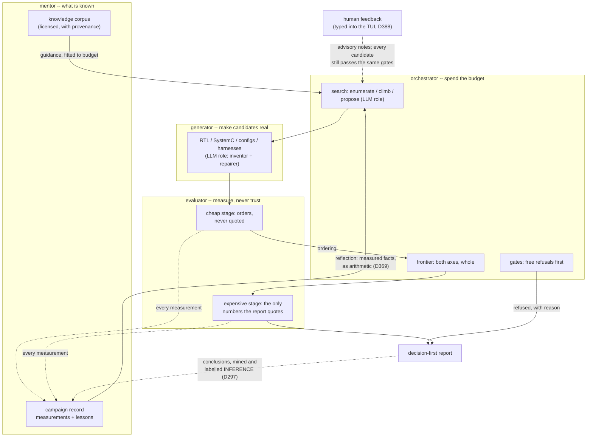

# The shape every loop shares

An application is one directory under `applications/`, and inside it one shape (D519):

```
applications/<name>/
  <name>.problem.yaml       the DOCUMENT: statement, parts, objectives, stages, budget, roles, campaign
  lib/src/flux_<name>/      the WORLD: the gate, the tools, the prompts, the transpiler -- named once under `world:`
  README.md                 the problem, the chain, the standings
```

`flux task run applications/<name>/<name>.problem.yaml --db <record>` runs it; another ask is
a copy of the document with its `params:` changed.

## Four roles, one loop

Every loop is the same four roles talking to each other, each with a model half and a
pre-written half (D460):



| role | directory | job | model's job title there |
|---|---|---|---|
| **mentor** | `mentor/` | hold what is known: the licensed knowledge corpus, the campaign record (`mentor/records`: results and conclusions), the laws extracted from it (`mentor/extract`), the operator's typed guidance | reader, author -- guidance is *fitted* to the prompt budget, never dumped |
| **orchestrator** | `core/loop` (the roles) | spend the evaluation budget: gates first, then search strategies, then the frontier; the shared decision arithmetic (`flux_frontier.decide` in `core/frontier`: corners, the knee, target-and-floor) picks the point | proposer -- one voice among enumerate/climb/solve, judged by the same gates |
| **generator** | `generator/` | turn a candidate into something a tool can run: RTL, SystemC, configs, harnesses | inventor and repairer -- every artifact verified against golden vectors before it counts |
| **evaluator** | `evaluator/` | measure on a chain of rising cost; adapters behind one ABI, calibrated against references | none -- numbers come from tools or not at all |

The phases inside the orchestrator keep their old names and their old discipline:

| phase | what it does |
|---|---|
| **setup** | find the tools (refuse loudly if absent), load the inputs, open the cache |
| **gates** | free checks first: validity, proofs of impossibility, budgets -- anything that can refuse in microseconds runs before anything that costs seconds |
| **screen** | the cheap stage of a real tool: orders candidates, never quoted |
| **frontier** | both objectives, whole: every candidate better than everything cheaper |
| **confirm** | the expensive stage, spent on finalists spread *along* the frontier, plus the incumbent and reference |
| **report** | decision first; lessons; refusals with reasons; what is *not* established -- the closing sections share one grammar (`core/report`), so no loop drifts into a synonym |

## The five nodes as an interface

Since D421 the loop is code, not only a picture: `core/loop` (`flux_loop`) runs it and a
`Problem` is what plugs in. The drawing's five nodes are the contract's hook groups:

```mermaid
flowchart TB
    IN["input / feedback / knowledge / records<br/><i>mentor</i>"] --> O
    O["(1) Orchestration<br/><i>orchestrator · model</i><br/>subgoals · plan_next"] --> G
    G["(2) Generation<br/><i>generator · model</i><br/>design_prompt · parse_design · patch · apply_tools"] <--> T["(3) test / validate<br/><i>evaluator, fast</i><br/>build · fast_check"]
    G --> E["(4) Evaluation<br/><i>evaluator, the chain</i><br/>judge · compose · stages · measure"]
    E --> R["(5) records<br/><i>mentor</i>"] --> O
    E --> OUT["output<br/>decide · conclusion"]
```



Every hook has a default, so a problem implements only what makes it different; the
[build-your-own page](build-your-own.md) lists them. Two hooks carry the design
freedom the older loops needed: `plan_next` (the default is the model choosing from a
schema-constrained menu; a problem may enumerate, anneal, or climb a fixed chain
instead) and `generate` (the default is the model inner loop -- design, build, fast
check, patch, revert, tools -- and a problem that solves or enumerates overrides it).

**One step loop, three kinds of work** (D446/D455/D457). The hooks above write a PART:
divide the goal, plan one part per step, write it against the fast test until the gate
admits it. A study that instead enumerates, solves, climbs, crosses two fields or lets a
model direct a menu works in BATCHES: `search(state)` is a generator yielding batches of
candidates, the loop gates each batch and measures the admitted ones on the first stage in
one call (`measure_batch`), then hands that batch's results back to the generator -- so a
policy with memory is one function, not a framework. A part may also be a whole SUB-TASK
(below). All three are one vocabulary in one step loop: both kinds are asked for every
pass, and with a part waiting while the search is live, `next_work` is the orchestrator's
decision about what the next step is for -- answered from code, from a rule, or by a
model. They then take the same frontier, spread the same finalists onto the costlier stage,
decide and conclude. The model-directed menu is part of the loop too
(`flux_loop.actions`).

**An evaluator's result has two ways out** (D463): to the orchestrator, which chooses the
next candidate, and back to the generator, which improves the one in hand. `route(stage,
scored, state)` returns the designs worth another draft, with the numbers as the reason, and
the generator sees them as a prior to rework rather than a blank page. An improvement is a
kind of work the step loop does, and so is climbing the chain, so a pass can go
evaluate -> improve -> evaluate without waiting for the next run. Two optional stops end a
pass early when you want them: `LoopRequest.budget_s` (a wall clock) and
`Problem.good_enough` (a target met); `LoopResult.stopped` says which.

**The chain is as many stages as the problem declares** (D454), with a cutoff
between them: `cutoff(stage, scored, state)` says what is worth the next stage, and
`flux_loop.cutoff` gives it as one line -- `above`/`below` for a floor or a budget the
answer must clear, `within_best` for a band around this run's own leader (the threshold
a study cannot know before the run). Each returns the survivors AND the rule in words,
so a report says "12 of 48 measured design(s) went no further: fmax below 90% of this
run's best" rather than a bare count. A cutoff that fails is a lost saving, never a
refusal: the run says so and every candidate climbs. The decision is made on the highest
stage that has results.

**A part may be another loop** (D455), which is the drawing's composition orchestrator:
`SubLoop(name, problem, request, statement)` is a part whose generator is a whole loop,
with its own gate, its own stages and its own record, and the parent takes what the child
DECIDED as that part. Either side may divide the problem -- a problem declares its
children (`subproblems`, or a document's `subtasks`) or the orchestrator names them at
runtime -- and `max_depth` bounds the nesting so a model-decided division cannot
recurse.

**The DSE methods will be orchestrators** (D465 promised it; plan step R6 builds it): a
document declares its `space:` and names a policy -- `sweep`, `montecarlo`, `anneal`,
`gradient`, `genetic`, `pareto-uct` -- that proposes the points and reads the numbers of the
batch it just proposed, which is what the loop handing results back to a generator is for.
Today the macarray enumerates its space in its world and the prefetcher climbs in its.
**Calibration is a node** (D464): wherever two stages measured the same design, the loop
reports how far apart they were per metric, with the spread and the count, and offers it to
`Problem.calibrated` -- never rewriting a measurement with a correction.

**Each role is a component you can switch** (D460). The four boxes each have an AI and a
no-AI half, and `flux_loop.roles` is where you say which: `rig(orchestrator="rules")` decides
the next step in code, `rig(orchestrator="given", ...)` takes the division from whoever wrote
the task, `rig(orchestrator="llm")` lets a model decide -- and the same bundle carries the
generation source, the evaluation stages and the knowledge sources, so an application swaps one
line instead of four kinds of thing. Evaluation's model half is plan
step R9 (a surrogate fitted on what this campaign has already measured, which orders
candidates before the real tools run and **can never be the last stage** -- a predicted number
is not an answer); today evaluation is the document's stages. Knowledge's is
`rig(knowledge="mined")`: the facts this project's own stored measurements support, plus the
conclusions a model drew from them, each carrying what it does not establish. A task document says it as `"roles": {...}`, a command
line as `flux task run --role orchestrator=rules`, and `flux task check` lists what each role
could be switched to. A component may decline a single decision, and an empty rig is exactly
the loop's own behaviour.

**Generation is the same shape one level down** (D456): draft, build, fast-check, and
again with the failure in hand. What differs between applications is not that loop but
WHO drafts, which `Problem.generator` names: `Model` (the model inner loop, the default),
`Template` (a renderer the framework runs), `Catalog` (designs that already exist, tried
in order) or `Solver` (a candidate computed from the constraints and told the last
counter-example). A source that raises is a refusal with its words, and a source that
returns the same artifact after a failure is stopped rather than left to spend the whole
repair budget. A task document can say `"generator": {"command": [...]}` or
`{"catalog": [...]}` and run the whole loop -- gate, stages, cutoffs, frontier, decision --
with no model anywhere in it.

Where each application sits against the contract -- all six are documents on the one loop:

| application | path | (1) orchestration | (2) generation | (3) fast test | (4) chain |
|---|---|---|---|---|---|
| **nlu** | parts | model plans one operator at a time, cooldowns | model + table oracle, patch/revert | authored unit vectors | exhaustive ULP -> compose -> yosys -> OpenROAD |
| **task document** | parts | the document's parts, in order | model, from the document's prompts | the document's checks | the document's stages |
| macarray | search | batch 1 the exhaustive product of PE configs; batch 1+k a multiplier invented that round, told the screen's numbers | template render; the invention runs through the loop's own generate/build/check/repair | Verilator on 12 golden products | golden-vector gate -> yosys -> OpenROAD, cached |
| prefetcher | search | each stage a policy over waves: seeded climb or Pareto-UCT, compose, tune, reference, shrink | JSON config proposals; C++ invention via a g++ repair loop | legality + storage budget | ChampSim screen -> reference -> confirm, cached |
| bankmap | search | the proof chain as one generator: baseline, pigeonhole, z3, feasible, model | JSON mapping proposals seeded with counter-examples | the exhaustive checker IS the gate | hardware cost of a conflict-free mapping |
| interconnect_mapping | search | the policy x fabric cross product, then model rounds, then coordinate descent | catalog + XOR climb + z3 + LLM tap sets | GF(2) injectivity | analytic traffic model -> proof -> simulator -> physical screen |
| omni | batches | pure model rounds: each round a batch of tool steps | plan of tool steps, repaired from refusals | catalog validation of each step (the gate) | one stage: running the tool. No decision -- omni concludes in words (D458) |

The pattern the table shows: the studies diverge in *policy* (what to try next), rarely in
what a candidate is or how it is judged. That is why the loop owns the chain and the
policy is a generator the problem writes.

## How a loop becomes an expert

The loop's knowledge is not a prompt that grows -- it is a record that compounds, and
every arrow in the flywheel is a mechanism with a decision-record entry behind it:

1. **Every measurement lands in the campaign record** (screen and confirm alike), keyed
   by the tool fingerprints and the code that ran -- so *resume means the record, read
   back* (D367): a second run starts where the first left off, and nothing measured is
   paid for twice.
2. **The record reflects as arithmetic, not memory** (D369): every one-knob pair the
   campaign has measured is a controlled experiment already paid for; its direction is
   computed fresh each run and handed to the first proposer prompt as *"what the record
   shows"* -- directions, not instructions.
3. **Conclusions are mined, labelled, and stored beside the data** (D297): what a run
   *meant* is written down as INFERENCE, distinct from what it measured, and the next
   run starts informed instead of rediscovering the shape of the space.
4. **Human feedback joins the same record** (D388, consumed by every model-role loop
   since D398): a note typed into the TUI reaches the next proposer prompt as HUMAN
   GUIDANCE -- advisory, persisted as a campaign event, echoed into the lessons; on a
   model-free run the lesson says honestly that the note reached no prompt.
5. **The knowledge corpus is curated, not scraped** (`mentor/knowledge`): licensed
   sources with provenance, mined into typed guidance, *fitted* to the model's context
   budget with what was dropped named -- a model reasoning from a narrowed view is told
   it is narrowed.
6. **The model is told what was refused, and why.** Refusals are not discarded; they are
   the cheapest teaching signal a search produces, and every proposer prompt carries
   them.

The result is the difference between an LLM *used by* a tool and an LLM *apprenticed
to* one: the roles give it jobs with acceptance tests, the record gives it the lab
notebook, and the gates make sure its confidence is never a substitute for a
measurement.

## The discipline that holds it together

Each rule was learned the expensive way, and each cites a numbered entry in the project's
[decision record](https://github.com/choelzl/flux/blob/main/docs/decisions.md):

- **Measured, not modelled.** A number in a report came from a real tool run, or it is
  labelled analytic. Screened numbers order; confirmed numbers get quoted.
- **A constraint is a refusal, not a low rank.** Below the floor, over the budget, failed its
  golden vectors: refused, with the reason recorded.
- **Two axes, one frontier.** Quality and cost are coordinates; the report lays the trade-off
  out and the decision rule -- a target, a floor, a preserved incumbent -- picks a point.
- **The model is a participant with a job title** -- proposer, inventor, repairer -- judged by
  the same gates as everything else, told what was measured and what was refused, and never
  the only path to a result.
- **Resume means the record, read back.** Caches are keyed by tool fingerprints and the code
  that ran; the campaign store re-seeds the next run, so nothing already measured is paid for
  twice.
