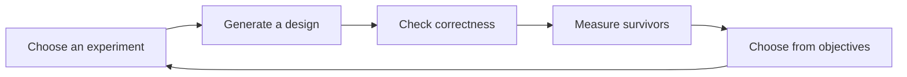

# Search and agents

A loop separates **what to try next** (`flow.orchestrate`) from **how to make the design**
(`flow.generate`). The gate and measurement stages establish the results. You can change the
search or generator while keeping those checks, measurements, and objectives.


```mermaid
flowchart LR
    O[Choose an experiment] --> G[Generate a design]
    G --> T[Check correctness]
    T --> M[Measure survivors]
    M --> S[Choose from objectives]
    S --> O
```

## Search a space of settings

Use a finite space when you can list meaningful choices. The generator and other commands
receive those choices as placeholders:

```yaml
flow:
  orchestrate:
    policy: sweep
    space:
      algorithm: [list_sieve, slice_sieve, odd_sieve]
      wheel: [0, 1]
    seeds:
      - {algorithm: list_sieve, wheel: 0}
  generate: {command: "{python} {home}/render.py {artifact} {algorithm} {wheel}"}
```

The seed is measured first; an omitted knob uses its first choice. The first seed is the
home point. Order numeric choices meaningfully because local search uses that order.

| Policy | How it chooses experiments |
|---|---|
| `sweep` | Enumerate distinct combinations; a useful baseline for a small space |
| `montecarlo` | Sample distinct random points |
| `gradient` | Follow measured improvements among nearby choices |
| `anneal` | Make local moves and sometimes accept worse points to escape a region |
| `genetic` | Evolve a population through selection and mutation |
| `pareto` | Explore trade-offs; requires at least two objectives |
| `model` | Ask a model to propose legal points from the space and measured history |

One pass normally carries one point. `budget.batch` lets it carry several; `budget.parallel`
runs several passes simultaneously. A policy finishing its finite walk does not, by itself,
stop an unlimited run. Use a pass cap for a bounded sweep.

Configure a policy's own options under its name:

```yaml
flow:
  orchestrate:
    policy:
      gradient: {steps: 16, patience: 2, reach: adjacent}
    space:
      block: [16, 32, 64, 128]
      order: [ijk, ikj, jki]
```

The [search reference](parameters.md#search-settings) lists policy options and defaults.
For a multi-phase search, keep the space and put a `phases` policy around its ordered phases:

```yaml
flow:
  orchestrate:
    space: {block: [16, 32, 64, 128], order: [ijk, ikj, jki]}
    policy:
      phases:
        phases:
          - {policy: montecarlo, name: sample, samples: 8, seed: 0}
          - {policy: gradient, name: tune, knobs: [block], steps: 8}
```

### Conditional choices and components

Avoid measuring a knob that has no effect on a chosen algorithm:

```yaml
space:
  algorithm: [list_sieve, slice_sieve, odd_sieve]
  wheel: {values: [0, 1], when: {algorithm: [list_sieve]}}
```

This is the `space` inside `flow.orchestrate`. Inactive choices sit at their home values and
are not repeatedly measured as different designs. A nested component groups its knobs:

```yaml
space:
  prefetch:
    optional: true
    distance: [1, 2, 4]
    degree: [1, 2]
```

The search sees `prefetch.on`, `prefetch.distance`, and `prefetch.degree`. `{point}` provides
these as nested JSON to a generator. A choice can also use `from: "out/invented/*.sv"` beside
`values` to include filenames discovered when the document loads.

## Let a model or agent explore designs

A model or agent can invent algorithms and architectures without a predefined knob space.
The default guidance is adaptive: reasoned risks are welcome, and exploration can happen
before the incumbent stalls. Select the emphasis using the existing `dse` setting:

In the loop configurator, open **Graph → DSE policy category**, then **DSE search policy**.
The category filters the second dropdown; it is only a UI filter and adds no document setting.
Changing category selects that category's first policy. A saved policy opens in its own category,
and the search box in the drawing offers the same categories.

| Category | Without settings in Extra | With a declared space of settings |
|---|---|---|
| Exploration and tuning | Guide the orchestrator's direction and design, repair and prototype prompts | A configured model proposes legal points with the selected emphasis |
| Search algorithms | Use the algorithm's emphasis as prompt and direction guidance | Run the selected finite-space algorithm; no model is needed for the walk |
| Model or agent | Choose who decides the next job and search direction | That model or agent proposes legal points from the space and measured history |

The default is adaptive. Without a knob space, a preference is saved as
`flow.orchestrate.dse`; with settings defined in **Extra**, it selects the search policy.
The model choice requires a configured model connection. Agents require their command and
credentials to be configured. Selecting an agent here does not change who writes code:
**Make a design** controls generation separately. With a parameter space, a generation
command can turn each proposed point into a design; otherwise the settings reach the check
and measurement commands directly.
Without a parameter space, a model or agent choice is saved as the orchestrator itself and
appears in **Pick the next job** when the document is reopened.

```yaml
flow:
  orchestrate: {by: claude, dse: adaptive}
  generate: claude
  critique: claude
budget:
  exploration_quota: 0.25
```

| `flow.orchestrate.dse` | Emphasis |
|---|---|
| `adaptive` | Choose local improvements or a new approach from the evidence |
| `explore` | Try materially different algorithms, architectures, or representations |
| `improve` | Improve the objectives through local or structural changes |
| `tune` | Favor parameter and implementation changes near promising designs |
| `finetune` | Favor small changes whose effect can be attributed |
| `variations` | Develop distinct versions of promising approaches |
| `sweep`, `montecarlo`, `anneal`, `gradient`, `genetic`, `pareto` | Apply the corresponding search emphasis to reasoning and prompts |

Here `dse` is prompt and choice guidance, not a hard ban on broader changes. It is distinct
from `policy`, which selects an actual search algorithm over a space. Prefer `policy: sweep`
for enumerating knob combinations; use `{by: claude, dse: explore}` to guide an agent's work.
The algorithm names all have implemented walks: `gradient` is coordinate descent over
discrete choices, rather than derivatives; `pareto` uses a tree guided by trade-offs across
the first two objectives. Without a space, these names guide the reasoning instead of
running those walks. Preferences influence choices but do not force every experiment to
follow them, and a script that writes a design does not read model prompts.

`exploration_quota` reserves a minimum share of recorded search choices for exploration,
including across parallel passes. It counts attempts, not elapsed seconds, successful designs,
or a guaranteed fraction of a finite grid. Use `0` for no enforced quota. Existing verified
candidates remain available when an experiment is worse or fails. Correctness checks and the
contract still apply to every new design.

Guidance reaches initial generation, repairs, prototype work, and later improvements. Logs
record the selected move and its reason. A finite budget or manual stop controls the run;
reaching a goal or keeping the same incumbent does not stop an unlimited campaign.

## Put agents in the right steps

Name an installed agent directly, and use `{by: ..., ...}` only when adding options:

```yaml
flow:
  validate: rules
  orchestrate: {by: claude, dse: adaptive}
  plan: {by: claude, session: pass}
  generate: {by: claude, timeout_s: 1800, probe: {gate: 20, stages: 3}}
  critique: claude
  select: {by: claude, finalists: 2}
  knowledge: {digest: claude, lessons: mined}
```

`claude`, `codex`, and `opencode` are built in; a server can offer additional named agents.
They can plan, generate, critique, and advise decisions. `flow.test` and `flow.measure` remain
commands or evaluators: an agent cannot replace their factual results. Selection still uses
the objectives; an agent's advice is checked and can fall back to the rules.

A generation agent resumes one session for a part through its repairs until that part is
admitted; a later improvement starts fresh. Do not set `session` on `generate`. Decision
steps such as `plan` and `critique` accept `session: turn` (default) or `session: pass`.

Agents can use `flux probe` to check their current file during a turn. `probe` budgets those
checks per turn. Direct use of certain raw tools is restricted by default; `allow` can give
specific tools back when that suits the task. See [agent options](parameters.md#agent-options).

For the direct model, use `orchestrate: {by: model, dse: adaptive}` and `generate: model`.
[Run and results](run.md#models-and-agent-environments) explains endpoint and agent setup.

## Split a larger design

`parts` names pieces of one artifact, either as a list, a map of descriptions, or `decompose`
to ask the orchestrator to divide it. `subtasks` names child loop folders instead. A child
inherits the parent's settings and overrides its own `flow`, `budget`, and `params` key by key.
The parent's generator can compose child answers:

```yaml
subtasks: [ops/recip, ops/exp]
flow:
  generate: {command: "{python} {home}/compose.py {parts} {artifact}"}
```

`{parts}` gives the composition script a JSON file of the child answers. Write and test the
composition as carefully as a generator. A parent using a model or agent instead can draft
for its children. The [document reference](parameters.md#document-fields) covers the nesting
limits, and the [NLU example](https://github.com/choelzl/flux/tree/main/flux/applications/nlu)
shows a larger loop split into child folders.
