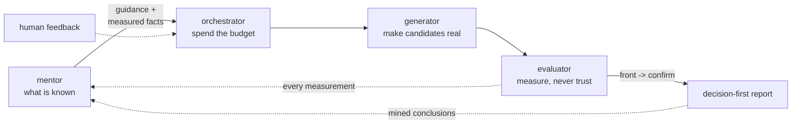

# Flux

**Design and DSE loops that aim to beat an engineer's result with the engineer's own tools.**
A Flux loop takes a stated problem -- an FP16 non-linear unit at 800 MHz, a prefetcher to
tune, a bank mapping to prove, a processing element to shrink -- and searches it with real
tools (Verilator, Yosys, OpenROAD, ChampSim, z3, ...) on a chain of rising cost. A model gets
*named roles* inside the loop; every loop runs end to end with no model. The model makes it
better, never possible.

The output is a decision-first report: the thing to build, with every number from the
measurement stage the report names, then the trade-off front, then what the run established,
what it did **not** establish, and what it refused -- with reasons.

## Why

The field does not lack cost models; it lacks a loop that is honest about what it measured. A
Flux problem is a **document** (`*.problem.yaml`: the statement, the parts, the objectives with
their goal and stage, the costed chain, the budget, who fills each role) plus a **world** (the
package that knows the domain: the gate, the tools, the prompts). One loop runs every document;
the record keeps every row with its provenance; the report separates measured from modelled.

## The loops

Six problems, each a document a copy of which is another ask:

| loop | one line |
|---|---|
| [NLU](demos/nlu.md) | an FP16 non-linear unit of seven operators, each within 1 ULP on all 65,536 inputs, at 800 MHz routed on ASAP7 with the least area and power |
| [macarray](demos/macarray.md) | the MAC processing element's microarchitecture: fmax vs area on ASAP7, with invented multipliers |
| [prefetcher](demos/prefetcher.md) | tune, compose and *invent* ChampSim L2 prefetchers for 5G traces |
| [bankmap](demos/bankmap.md) | a conflict-free bank mapping through a described interconnect, or a proof none exists |
| [interconnect mapping](demos/interconnect_mapping.md) | bank hashes vs tensor tiles: 12 storage modes into a 32-bank L1, a four-cost front with proofs |
| [omni](demos/omni.md) | one prompt, the whole toolbox: an agent plans over every Flux tool and concludes from what ran |

```bash
cd flux
nix develop --command flux task run applications/nlu/nlu.problem.yaml --db demo-nlu.db --tui
```

## The shape every loop shares

Four roles, each with a model half and a pre-written half, swappable from the document:



The **mentor** holds the knowledge and the record; the **orchestrator** refuses for free
before spending, picks the work and keeps the front; the **generator** turns candidates into
artifacts real tools can run (a model with a prototype stage and repair turns, or a template, a
catalog, a solver); the **evaluator** measures on a chain of rising cost, where the shallow
stages order and the deepest decides. The model holds *job titles* inside those roles --
proposer, inventor, repairer, orchestrator -- judged by the same gates as everything else, and
the gate itself is never delegated. Every measurement, refusal, conclusion and typed human note
flows back into the record, which is how the loop gets more expert with every run.
[The full shape](guide/loop-shape.md), or [build your own loop](guide/build-your-own.md).

## The tool surface

Every loop is also a CHIA node and an MCP tool over its document, beside the evaluators, the
stores and the knowledge layer; the [catalog](catalog/index.md) documents all of them, generated
from the same introspection the omni agent plans over. Nothing on those pages is hand-listed,
so nothing on them can rot.
