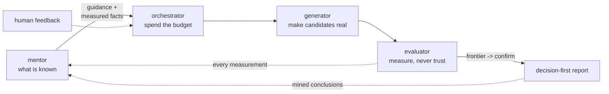

# Flux

**Agent-native design-space exploration for SoC building blocks.** A Flux loop takes a stated
problem -- a prefetcher to tune, a bank mapping to find, a processing element to shrink -- and
searches it with real tools (Verilator, Yosys, OpenROAD, ChampSim, z3, ...) on a ladder of
rising cost. A local LLM gets one or two *named roles* inside the loop; every loop runs end to
end with no model installed. The model makes it better, never possible.

The output is a decision-first report: the thing to build, with every number from the
measurement rung the report names, then the trade-off frontier, then what the run established,
what it did **not** establish, and what it refused -- with reasons.

## Why

The design-space-exploration field does not lack cost models; it lacks a **contract**. Every
framework hard-codes its own workload representation, architecture description, and search loop
into a monolith, which makes cost models non-substitutable, results non-comparable, and
searches non-reusable. Flux is the missing middle: a formalised IR, an evaluator contract, a
calibration and provenance layer, and -- on top of them -- runnable design loops exposed to
agents as a first-class tool surface.

## The demo loops

Six loops, each a real problem searched with real tools:

| loop | one line |
|---|---|
| [interconnect](demos/interconnect.md) | 28 clients to 32 banks, area-optimal at 600 MHz, on placed ASAP7 silicon |
| [interconnect mapping](demos/interconnect_mapping.md) | bank hashes vs tensor tiles: 12 storage modes into a 32-bank L1, a four-cost Pareto with proofs |
| [bankmap](demos/bankmap.md) | a conflict-free bank mapping through a described interconnect, or a proof none exists |
| [macarray](demos/macarray.md) | the MAC processing element's microarchitecture: fmax vs area on ASAP7 |
| [prefetcher](demos/prefetcher.md) | tune, compose and *invent* ChampSim L2 prefetchers for 5G traces |
| [omni](demos/omni.md) | one prompt, the whole toolbox: an agent plans over every Flux tool and concludes from what ran |

## The shape every loop shares

Four roles -- and they are literally the repository's top-level directories:

The **mentor** holds the knowledge corpus and the campaign record; the **orchestrator**
refuses for free before spending, searches, and keeps the frontier; the **generator**
turns candidates into artifacts real tools can run; the **evaluator** measures on a
ladder of rising cost. The model holds *job titles* inside those roles -- proposer,
inventor, repairer, author -- judged by the same gates as everything else. Every
measurement, refusal, mined conclusion, and typed human note flows back into the
record, which is how the loop -- and the model inside it -- gets more expert with
every run. [The full shape and the expertise flywheel](guide/loop-shape.md), or
[build your own loop](guide/build-your-own.md).

## The tool surface

Every capability is one typed Python function exposed three ways -- a library call, a CHIA
orchestration node, and an MCP tool -- and the [catalog](catalog/index.md) documents all of
them, generated from the same introspection the omni agent plans over. Nothing on those pages
is hand-listed, so nothing on them can rot.
