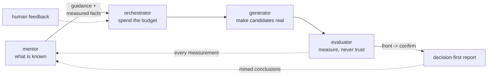

# Flux

**Design and DSE loops that aim to beat an engineer's result with the engineer's own tools.**
A Flux loop takes a stated problem -- an FP16 non-linear unit at 800 MHz, a prefetcher to
tune, a bank mapping to prove, a processing element to shrink -- and searches it with real
tools (Verilator, Yosys, OpenROAD, ChampSim, z3, ...) on a chain of rising cost. A model gets
*named roles* inside the loop; every loop runs end to end with no model. The model makes it
better, never possible.

The output is a decision-first report: the thing to build, with every number from the
measurement stage the report names, then the trade-off front, then what the run established,
what it did **not** establish, and what it refused -- with reasons.

## Why

The field does not lack cost models; it lacks a loop that is honest about what it measured. A
Flux problem is a **document** (`*.problem.yaml`: the statement, the parts, the objectives with
their goal and stage, the costed chain, the budget, who fills each role) plus, only for what a
document cannot say, a **world** (a Python package that knows the domain: a simulator, a
solver, a generator that invents across rounds). One loop runs every document;
the record keeps every row with its provenance; the report separates measured from modelled.

## The loops

Eight problem documents, each a copy of which is another ask. Five are studies:

| loop | one line |
|---|---|
| [NLU](demos/nlu.md) | an FP16 non-linear unit of seven operators, each within 1 ULP on all 65,536 inputs, at 800 MHz routed on ASAP7 with the least area and power |
| [macarray](demos/macarray.md) | the MAC processing element's microarchitecture: fmax vs area on ASAP7, with invented multipliers |
| [prefetcher](demos/prefetcher.md) | tune, compose and *invent* ChampSim L2 prefetchers for 5G traces |
| [bankmap](demos/bankmap.md) | a conflict-free bank mapping through a described interconnect, or a proof none exists |
| [interconnect mapping](demos/interconnect_mapping.md) | bank hashes vs tensor tiles: 12 storage modes into a 32-bank L1, a four-cost front with proofs |

Three are the smallest complete examples of a problem of your own: `adder16` (a sweep over
generated adders, no model), `mul8` (a model writes a multiplier against a golden model) and
`primes` (not hardware: a model writes a Python function and keeps making it faster).
`flux new NAME --kind python|rtl|sweep` writes the start of another.

## Start

From the `flux/` directory of a checkout, with [Nix](https://nixos.org/download) installed:

```bash
nix develop --accept-flake-config     # once: accept the binary cache for OpenROAD, Yosys, ...
nix develop --command flux selftest   # does it work here: tools, a sweep, the model server
nix develop --command flux task run applications/adder16/adder16.problem.yaml --screen-only --passes 1
```

`flux selftest` prints PASS, FAIL or SKIP per check, with the reason. The last line needs no
model: it sweeps twelve adders through Verilator and Yosys and prints a decision-first report
in about three minutes. Then [run the others](demos/index.md), or describe
what you want in words and let `flux ask` write the problem for you (that needs a model):

```bash
nix develop --command flux ask "a signed 8x8 multiplier, the smallest that makes 1 GHz placed"
```

To set up a problem of your own, step by step, follow the [tutorial](guide/tutorial.md).

## The shape every loop shares

Four roles, each with a model half and a pre-written half, swappable from the document:


```mermaid
flowchart LR
    mentor["mentor<br/>what is known"] -- "guidance +<br/>measured facts" --> orch["orchestrator<br/>spend the budget"]
    human["human feedback"] -.-> orch
    orch --> gen["generator<br/>make candidates real"]
    gen --> eval["evaluator<br/>measure, never trust"]
    eval -- "front -> confirm" --> report["decision-first report"]
    eval -. "every measurement" .-> mentor
    report -. "mined conclusions" .-> mentor
```

The **mentor** holds the knowledge and the record; the **orchestrator** refuses for free
before spending, picks the work and keeps the front; the **generator** turns candidates into
artifacts real tools can run (a model with a prototype stage and repair turns, or a template, a
catalog, a solver); the **evaluator** measures on a chain of rising cost, where the shallow
stages order and the deepest decides. The model holds *job titles* inside those roles --
proposer, inventor, repairer, orchestrator -- judged by the same gates as everything else, and
the gate itself is never delegated. Every measurement, refusal, conclusion and typed human note
flows back into the record, which is how the loop gets more expert with every run.
[The full shape](guide/loop-shape.md), or [build your own loop](guide/build-your-own.md).

## Scripts and agents

There is one way in: the `flux` command. A script runs a document with
`flux task run DOC --json answer.json` and reads the decision, the frontier, what was refused
and the application's own result from that file. A coding agent (Claude Code, Codex, OpenCode,
any command) can write the problem for `flux ask`, or be the generator of any document with
`flow: {generate: {agent: opencode}}`; skills (`skills:` in the document, `--skill DIR`) feed
both the model and the agents.
